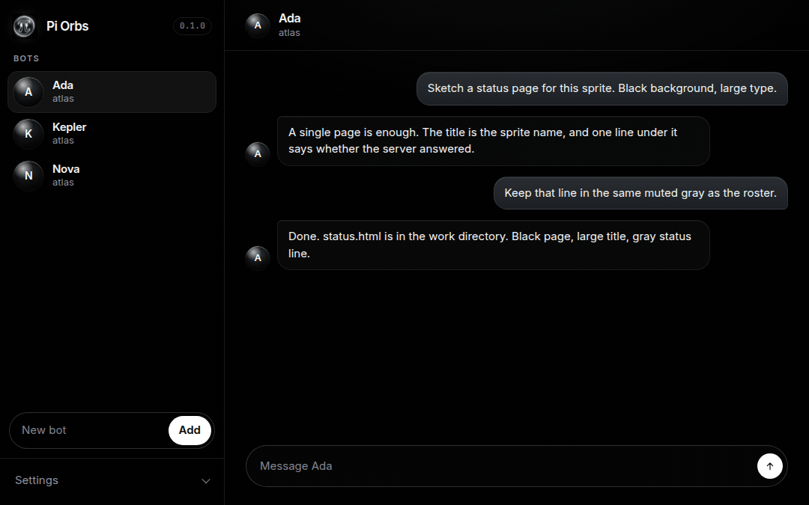
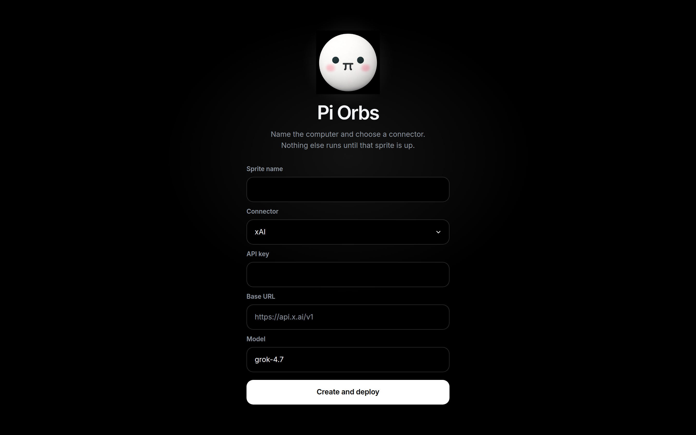
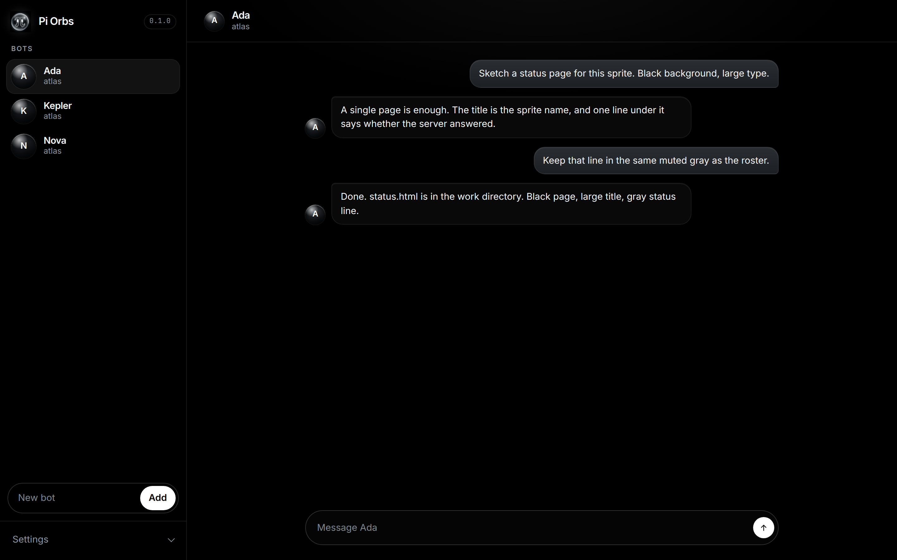
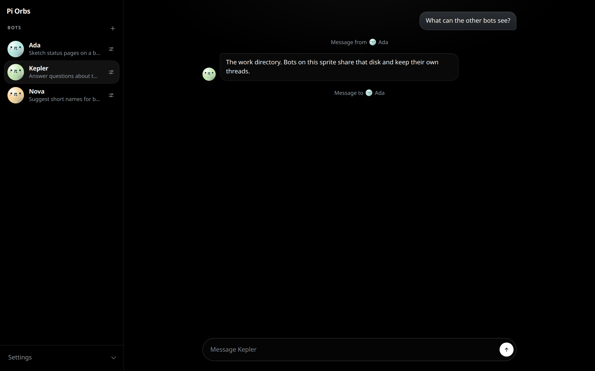
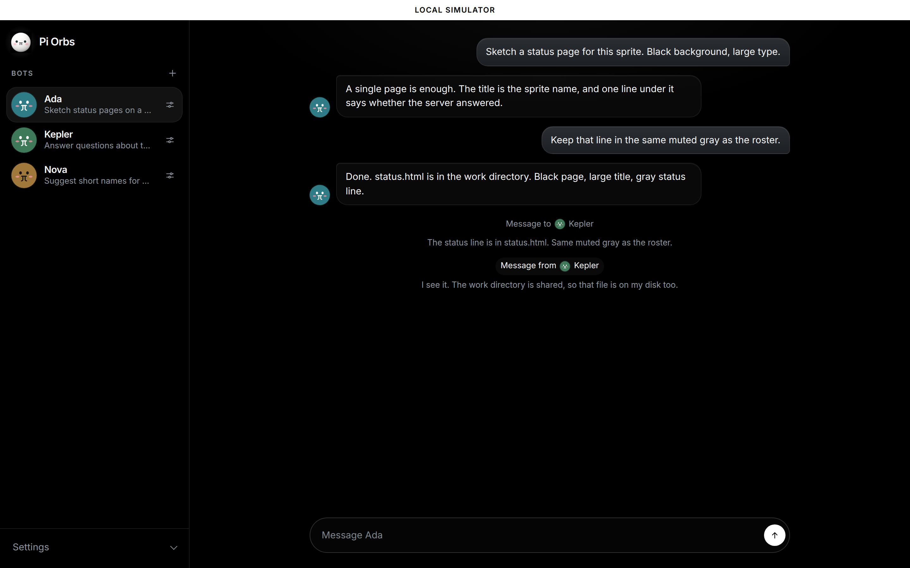
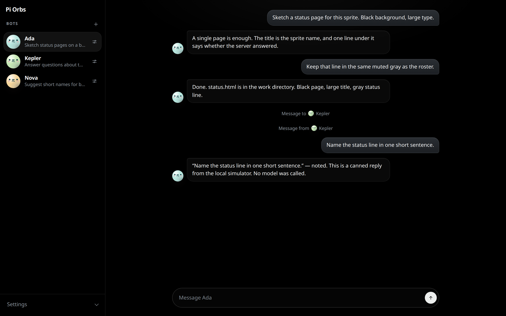

<p align="center">
  
</p>

<h1 align="center">Pi Orbs</h1>

<p align="center">Named Pi bots on one shared Fly.io Sprite — install the client, it deploys the server.</p>

<p align="center">
  <a href="https://github.com/richardanaya/pi-orbs/actions/workflows/ci.yml"></a>
  &nbsp;
  <a href="https://www.npmjs.com/package/pi-orbs"></a>
  &nbsp;
  <a href="LICENSE"></a>
</p>

<p align="center">
  <a href="https://piorbs.com/">piorbs.com</a>
  ·
  <a href="docs/architecture.md">Architecture</a>
  ·
  <a href="CONTRIBUTING.md">Contributing</a>
  ·
  <a href="SECURITY.md">Security</a>
</p>

Named bots, each one a durable Pi thread, sharing one Fly.io Sprite as their computer.

What you install is the client. The client keeps the Sprite list, creates bots, and pushes a server build onto a Sprite when you ask it to.

## Try

```bash
npx pi-orbs
```

You need Node 20 or newer. The first screen asks for a [Sprites API token](https://docs.fly.io/sprites/api/). Pi Orbs stores that token in `~/.pi-orbs/state.json` and calls `https://api.sprites.dev`. The sprite CLI is not required.

Open http://127.0.0.1:8787.



Until a sprite is running, the page is the setup form: a sprite name, a connector, an API key, a base URL, a model, and **Create and deploy**. The connectors are xAI, OpenAI, Anthropic, and Custom. xAI is the default. That creates the Sprite, makes its URL public, stores the key in a Sprites connection, and installs the server. The connection id, the sprite URL, and an API secret are written to `~/.pi-orbs/state.json`. The API key is not copied into the sprite service environment. Voice is optional on that form: Grok or OpenAI, plus a realtime key. The voice key stays in the state file too, and the page does not receive it. A cron-job.org API key is optional on the same form. The page does not receive that key either.



## The interface

After a sprite is up, the page is a roster and a thread. The first bot is selected on load.



Ada, Kepler, and Nova. Flat π faces, and **Add** is the plus on the right. The selected bot’s thread is open beside the roster.



A thread. Each bot keeps its own. A steer from another bot is a line in that thread.

Open the line to read who sent it and the message. The roster face pulses while that bot is working.



Choose **Add** (the plus) to name a bot, write its instruction, and pick a glass orb. The same dialog edits a bot from the roster, and can delete it. Each bot is its own Pi conversation. They share `/home/sprite/work` and the one model from setup. Send a message in the bar at the bottom. The thread refreshes every few seconds.



The same thread after a message is sent.

**Settings** holds voice, a cron-job.org API key, **Download all conversations**, **Push server build**, and **Destroy sprite**. Voice saves an optional Grok or OpenAI realtime key. When that key is set, **Voice** on the open bot starts a call, and **Stop** ends it. The voice agent can search that bot’s chat and the call, send a task the way a human message does, and stop the call. The cron-job.org key lets a bot schedule a message into its own chat. Download saves a zip of every bot thread as JSON transcripts (bot id, name, and message timestamps). It does not include API keys or connector credentials. Push installs this package's server on the sprite. Destroy deletes that sprite and the connector that was saved with it, then the page returns to setup.

How the pieces connect, and what to check when setup fails, is in [Architecture](docs/architecture.md#troubleshooting).

## From a checkout

```bash
npm install --prefix server && npm install --prefix client
npm run build
npm start
```

`npm start` is the same client as `npx pi-orbs`.

## Test

From a checkout, after client and server dependencies are installed:

```bash
npm test
```

That runs the client simulator tests, then builds the server and runs its smoke tests: `/version` is public, requests without the API secret get 401, a Bearer token can create a bot and list it, and `GET /api/export` returns those transcripts without the API secret. The simulator tests also unpack a zip of the seeded conversations. The full run needs Node 22. The server process needs `node:sqlite`, which Node 20 does not include. The simulator tests alone run on Node 20 with `npm test --prefix client`.

## Site

The project homepage is [https://piorbs.com/](https://piorbs.com/). It is static. Nothing has to be built to view it.

`index.html` is the entrypoint, at the repository root. `website/` holds the stylesheet, script, mark, launch video, and share image. The 0.3 release / product video is composed in [`website/remotion/`](website/remotion/README.md) (`npm run preview` and `npm run render` there). The interface pictures are:

- `docs/local-demo.gif`
- `docs/local-setup.png`
- `docs/local-roster.png`
- `docs/local-thread.png`
- `docs/local-peers.png`
- `docs/local-reply.png`

Those paths resolve when the site is served from the repository root, including GitHub Pages. `CNAME` publishes that root at `piorbs.com`.

To publish with GitHub Pages: repository **Settings → Pages → Build and deployment → Source: Deploy from a branch**. Branch: `master`. Folder: **/ (root)**. Use the root, not `/docs`. `/docs` would publish only the screenshot folder.

`.nojekyll` is at the root so Pages copies the files as committed and does not run Jekyll.

## Publish

`npm publish` from this repo runs the build first. The npm package includes the client, the server `dist`, and the server lockfile the Sprite installs from. `node_modules`, `dist` in git, tarballs, and env files stay out of the repository. The git remote is `git@github.com:richardanaya/pi-orbs.git`.

Version bumps and the later tag are in [RELEASE.md](RELEASE.md). After the `0.1.0` bump is on `master` and the release is OK:

```bash
git tag v0.1.0 && git push --tags
```

That push opens a GitHub Release from the `[0.1.0]` section of [CHANGELOG.md](CHANGELOG.md). It does not publish to npm. `server/VERSION` is what `GET /version` returns, and it matches the package version.

## Contributors

Install, build, tests, pull requests, and the UI simulator are in [CONTRIBUTING.md](CONTRIBUTING.md). Report security issues the way [SECURITY.md](SECURITY.md) describes.
