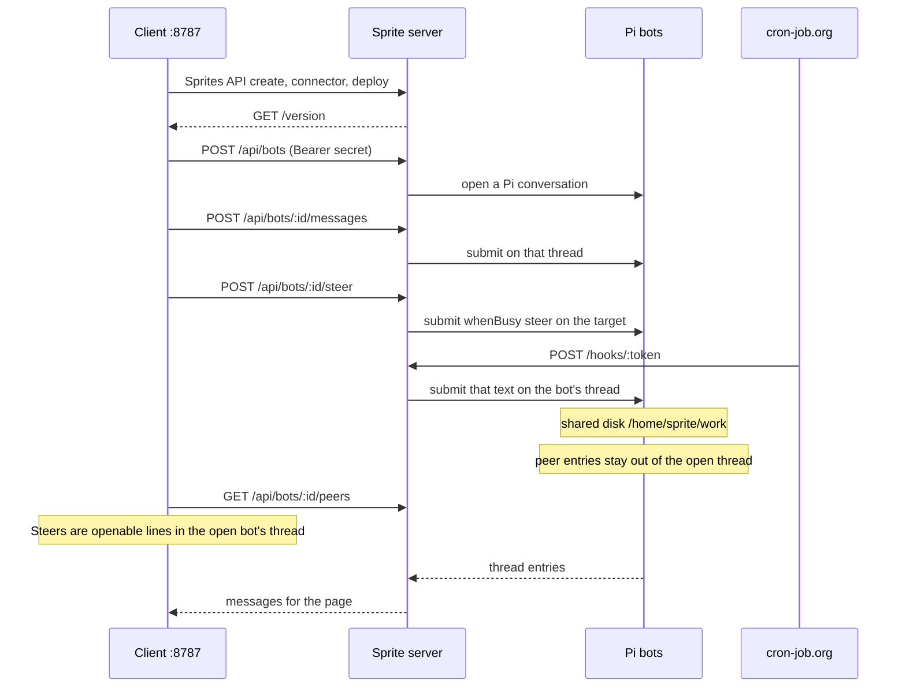

# Architecture

Pi Orbs is two processes. The client is what you install and open in a browser. The server is what runs on one Fly.io Sprite and hosts the bots.

## Client and server

The client listens on port 8787. `npx pi-orbs`, `npm start`, and `node ./bin/pi-orbs.js` all load `client/dist` (built from `client/src`). The page is http://127.0.0.1:8787. That process serves `client/public` and the `/api/sprites` routes the page calls. It talks to Sprites over HTTPS at `https://api.sprites.dev`, with the API token saved from the first screen. The sprite CLI is not used.

The server is `server/dist/server.js`, built from `server/src/server.ts`. During normal use it runs on the Sprite. **Create and deploy** and **Push server build** pack `server/dist`, `server/package.json`, `server/package-lock.json`, and `server/VERSION`, copy that archive onto the Sprite, and `npm install --omit=dev` under `/home/sprite/app`. The Sprite service `web` is then recreated as:

- command: `/.sprite/bin/node /home/sprite/app/dist/server.js`
- working directory: `/home/sprite/work`
- HTTP port: `8080`

The client marks the Sprite URL public (`PUT /v1/sprites/{name}` with `url_settings.auth` `public`) and calls that URL. `GET /version` is unauthenticated and returns `{ "version": "<server/VERSION>" }`. Other routes require `PI_API_SECRET`, sent as `Authorization: Bearer` (the server also accepts `x-api-key`).

The client keeps a single sprite. A successful create replaces `sprites` in the state file with that one entry.

## State

The client stores its sprite on the machine where it runs, at `~/.pi-orbs/state.json`. Saving the Sprites API token creates the file. A sprite record is added after the first successful deploy. Local simulator mode does not read or write it.

The JSON is `{ "spritesToken", "sprites": [ { "name", "url", "secret", "apiKey", "connectorId", "connectorType", "baseApiUrl", "model", "voiceProvider", "voiceApiKey", "cronApiKey" } ] }`. Older files may have `xaiKey` instead of `apiKey`. The client treats a missing `connectorType` as xAI. `voiceProvider` and `voiceApiKey` are optional. Voice stays off when they are absent. `cronApiKey` is optional. Schedules stay off when it is absent.

- `name` is the Sprite name.
- `url` is the public Sprite URL.
- `secret` is `PI_API_SECRET`, generated by the client (`randomBytes(24)` hex) and reused for that name if the file already has it.
- `apiKey` is the key from the setup form. For an xAI connector it is also stored as `xaiKey`.
- `connectorId` is the Sprites connection created for that key.
- `connectorType` is the setup preset (`xai`, `openai`, `anthropic`, or `custom`).
- `baseApiUrl` is the preset base URL, or the URL typed for Custom.
- `model` is the one model every bot on this sprite uses.

The page never receives `apiKey`, `xaiKey`, `voiceApiKey`, or `cronApiKey`. The client drops them from API responses. A voice call can return a short-lived provider `clientSecret`. That value is not the stored voice key. Sprite responses include `cron: { "configured" }` and nothing else about the cron-job.org key. Leave this file on that machine. Do not commit it or paste it into an issue. See [SECURITY.md](../SECURITY.md).

Create writes the file only after `GET /version` succeeds. **Push server build** writes the connector id before it installs, so a failed push can still leave a state file in place.

## Connector

The setup form asks for a sprite name, a connector type, an API key, a base URL, and one model. xAI is the default. Preset base URLs are fixed. Custom is the only type with an editable base URL. The model field starts from that type’s suggestion and is the model every bot uses. It is not chosen per bot.

The client stores the key in a Sprites `custom_api` connection (header bearer token). xAI reuses a connection named `pi-orbs xAI` when one already exists. OpenAI reuses `pi-orbs OpenAI`. Anthropic reuses `pi-orbs Anthropic`. Custom reuses `pi-orbs custom` plus the base URL. An existing connection is reused as-is. The client does not replace its token.

The server does not get the key. Its service environment is:

| Variable | Value |
| --- | --- |
| `PI_API_SECRET` | the secret from the state file |
| `PI_MODEL` | the shared model from setup |
| `PI_API` | `openai-responses` for xAI, `anthropic-messages` for Anthropic, otherwise `openai-completions` |
| `PI_DB` | `/home/sprite/app/data/agent.sqlite` |
| `PI_CWD` | `/home/sprite/work` |
| `PI_BASE_URL` | `https://api.sprites.dev/v1/gateway/custom_api/<connector id>` |
| `PI_XAI_BASE_URL` | the same gateway URL |
| `XAI_API_KEY` | `connector` |
| `OPENAI_API_KEY` | `connector` |
| `PORT` | `8080` |
| `PI_PUBLIC_URL` | the public Sprite URL |
| `CRON_JOB_ORG_API_KEY` | the optional cron-job.org key, only when one is saved |

`XAI_API_KEY=connector` and `OPENAI_API_KEY=connector` are placeholders. The model client uses the gateway URL, so bot requests go through Sprites, which holds the connector key. **Destroy sprite** deletes that connection, then destroys the Sprite. The voice key is not one of these variables. `CRON_JOB_ORG_API_KEY` is the saved cron-job.org key when schedules are on. It is not the connector key.

## Voice

Setup and Settings can store an optional realtime voice provider, Grok or OpenAI, and a voice API key. Voice stays off until both are set. The key is separate from the connector key. On a sprite it is written to `~/.pi-orbs/state.json` as `voiceProvider` and `voiceApiKey`. The local simulator keeps the same fields in memory and does not write that file.

Sprite responses include `voice: { "provider", "configured" }` and nothing else about the key. The key is not copied into the Sprite service environment.

`POST /api/sprites/:name/voice` saves or clears the provider. A blank key keeps the saved key when the provider does not change. Changing the provider needs a key. An empty provider turns voice off.

`POST /api/sprites/:name/bots/:id/voice` starts a call with that bot. The client mints a short-lived token with the stored key and returns it as `clientSecret`, plus `realtime` (`url`, `transport`, `model`). Grok uses `POST https://api.x.ai/v1/realtime/client_secrets`. The page opens `wss://api.x.ai/v1/realtime?model=grok-voice-latest` with the token in the WebSocket protocol `xai-client-secret.`. OpenAI uses `POST https://api.openai.com/v1/realtime/client_secrets` with the three tools bound on that session. The page connects with WebRTC to `https://api.openai.com/v1/realtime/calls`. If the provider echoes the stored key, or puts it in an error, the client does not send that text to the page.

The local simulator uses the same start route and returns `provider: "local"`. It does not mint a token and does not call Grok or OpenAI. The call dock has a Say field that appends a line to the transcript. No model speaks.

The voice agent has exactly three tools. The page does not add others. It posts each tool call to `POST /api/sprites/:name/bots/:id/voice/:sessionId/tools`, and the client runs it:

1. `search_messages` searches that bot’s chat and this call’s transcript. Matches come back with the voice key redacted.
2. `send_task` submits the text on `POST /api/bots/:id/messages`, the same path as the composer. The bot starts on that human turn. It is not a steer and not another sprite. The local simulator answers with the same canned reply as a typed message.
3. `stop_voice` ends the call. **Stop** on the page calls `DELETE` on that session, which ends it too.

Spoken lines are stored with `POST .../voice/:sessionId/transcript` so search can see them. They stay on the client for that call. They are not a second bot thread. `GET` of the session returns the three tools and does not return the voice key or the client secret.

## Scheduled messages

Setup and Settings can store an optional [cron-job.org](https://docs.cron-job.org/rest-api.html) API key. Schedules stay off until it is set. On a sprite the key is `cronApiKey` in `~/.pi-orbs/state.json`. Deploy also copies it into the Sprite service environment as `CRON_JOB_ORG_API_KEY`, because the schedule tool runs on the sprite. Settings writes the same value to `cron.json` next to the roster so a later change applies without waiting for the next deploy. The page receives `cron: { "configured" }` only.

Each bot has a durable webhook token (`randomBytes(24)` hex) stored on the roster and omitted from bot JSON. The address is `{PI_PUBLIC_URL}/hooks/{token}`. cron-job.org is not given the API key. A POST to that path is authorized by the token alone, with `timingSafeEqual`. A missing or wrong token is `401`. The cron-job.org key is not accepted as webhook auth.

The `schedule_message` tool creates one cron-job.org job (`PUT /jobs`) for the bot that called it. The job is enabled, POSTs JSON `{ "content" }` to that bot’s webhook, and does not save responses. The tool takes a five-field cron expression and an optional IANA time zone (UTC when omitted). The server stores the remote `jobId`. Creating the same tool call again returns that id and does not create a second job. The tool’s reply is the job id. It does not include the API key or the webhook token.

When the webhook is hit, the server submits that `content` on the bot’s conversation the same way `POST /api/bots/:id/messages` does. The text is a normal user message. It is not a steer, it does not carry `pi-orbs-peer-hop`, and the hop rules are unchanged.

Deleting a bot deletes that bot’s cron-job.org jobs first (`DELETE /jobs/{jobId}`). A `404` from cron-job.org counts as already gone. If the delete fails, the bot stays so the job is not left behind. Clearing the key deletes every stored job first, then forgets the key. Destroying the sprite asks the server to delete every stored job before the sprite is removed. The local simulator keeps the same routes. It stubs cron-job.org in memory and accepts webhook posts in-process. It does not call cron-job.org.

## Bots and `/home/sprite/work`

Each bot is one Pi conversation in a single pi-durable harness. The harness database is `/home/sprite/app/data/agent.sqlite`. The roster is `/home/sprite/app/data/bots.json`: id, name, conversation id, instruction, and look. Threads are separate. Every bot uses the sprite’s shared model. The instruction is that conversation’s `instructions` section: it is set when the conversation is created, and **edit** calls `conversation.configure({ instructions })`. The shared model allows mid-conversation system messages, so a later instruction change is sent in place on the next request. An empty instruction clears the section. The create and edit dialog writes three fields. `name` is at most 80 characters. `instruction` is optional, at most 8000 characters, and an empty value clears it. `look` is one of `slate`, `silver`, `mist`, `tide`, `pine`, `amber`, `clay`, or `plum`, drawn as a glass orb in the dialog, the roster, and the thread header. A new bot without a look gets the least-used orb. Older records without these fields still load.

The coding tools for every bot use `PI_CWD`, which deploy sets to `/home/sprite/work`, and the `web` service uses that directory as its working directory. Bots on the sprite share that disk.

Each bot can call `create_mcp_event_webhook`. That mints a public `POST /api/mcp-events/:token` URL on `PI_PUBLIC_URL` (the sprite URL) and a `whsec_` secret. An MCP server uses both as `events/subscribe` webhook delivery. The route is unauthenticated aside from the token and a Standard Webhooks signature. A body with `type: "verification"` echoes `challenge`. Any other signed body is submitted into that bot's conversation with `whenBusy: "followUp"`. Hooks live in `mcp-events.json` beside the roster.

Sending a message submits text to that conversation and returns immediately (`202`). The page reloads the thread every few seconds. A reload that does not change the visible messages leaves the scroll where it is. Sending a message still follows the new line.

## Cross-bot steering

Bots on one sprite share the harness and the work directory. They do not share a thread. Bot A messages bot B through the server, which steers that text into B’s Pi conversation.

`POST /api/bots/:id/steer` with `{ "from", "content" }` checks that both bots exist and that a bot is not steering itself. The server then calls Pi Durable:

```ts
conversation.submit({ type: "input", content, whenBusy: "steer", requestId }, context)
```

`whenBusy: "steer"` is the harness primitive. If B is idle, the input starts a turn. If B is busy, the input waits in that conversation’s inbox and is placed after the current tool round, joining the run in progress. A follow-up would wait until the run finished. A reject would fail the call. The `requestId` starts with `peer:` so a retry of the same id does not admit a second input.

The model sees a short preface plus the content: who sent it, that they are another bot, and that the human’s thread does not show it. Pi Durable admits that input as a `pi.user` entry. There is no separate peer entry kind that both starts a run and stays out of `pi.user`. The preface is how the model tells a peer from the human.

What is stored:

- The steered input, and any later assistant answer, stay in B’s conversation in `agent.sqlite`.
- A ledger next to the roster, `peers.json` (`PI_PEERS` overrides the path), keeps one row per steer: id, from, to, names at send time, the original content, `requestId`, submission id, entry id once the input is placed, and `createdAt`. The ledger keeps the latest 1000 rows. `GET /api/bots/:id/peers` returns rows where that bot is sender or target. Each row has `delivery: "steer"`.

The open thread does not treat those rows as human messages. `GET /api/bots/:id` still returns `{ bot, messages }` for the page, and omits a peer user entry. The assistant reply that follows stays, so a result steered back shows up in the thread. The page ignores a message flagged `peer` or `source: "peer"` if one is ever returned, and it does not rebuild or jump the scroll when the visible transcript is unchanged.

Steers for the open bot are lines in that bot’s thread. Each line reads “Message from” or “Message to” and shows the other bot’s face. Opening the line shows the message. The roster Peers button is hidden, and there is no panel beside the thread. `GET /api/bots/:id` returns those rows as `pi.peer` messages, and only for that bot. `GET /api/bots/:id/peers` is the same single-bot ledger. Each row is `id`, `from`, `to`, `fromName`, `toName`, `content`, `submissionId`, `createdAt`, and `delivery: "steer"`, plus `entryId` once the input is placed. A poll that does not change the visible thread leaves the scroll where it is.

`GET /api/bots/activity` returns `{ "busy": ["<bot id>", ...] }`. A bot is busy while that conversation has a live task, or a submission that is still queued or placed. The roster draws a pulse on that orb. If a busy bot is not the one open in the thread, the thread bar says that bot is working. The local simulator uses the same routes. A steer marks the target busy for a few seconds. The simulator also starts with one Ada and Kepler exchange already in the ledger, so those lines are in the thread on first load. Creating the sprite again clears that sample.

A bot can send the same steer itself. The `peers` extension adds a `steer_peer` tool (name or id, plus content) and a system section that lists the other bots. The tool uses the same server path and a request id tied to the tool call, so a replay after a crash does not send twice.

Every bot’s Pi instructions are its own text plus one shared postfix. The postfix says cross-bot messages are need-to-know. If the human asks a bot to contact another, that bot calls `steer_peer` in the same turn. Saying it will does not send the message. If a bot is asked for something, it steers the result back once, because the sender needs that result. It does not steer thanks or a second follow-up. The saved instruction and the edit dialog stay the user’s text. The postfix is applied when the bot is created, when the instruction is edited, and the next time an existing conversation is opened.

The server also stops a loop without trusting the model. A steer that starts from a human turn is hop 1. A steer made while handling a bot message is the next hop. Hop 3 is refused with `peer chain is closed`. An incoming bot message may cause only one further steer; a second steer of that same message is refused the same way. The steered text carries `pi-orbs-peer-hop` and `pi-orbs-peer-id` so the next turn can read the chain. Those lines are part of the hidden peer user entry.

The local simulator has no Pi harness, so it does not call `submit`. It stores the same ledger row, with a `local-` submission id, keeps the latest 1000 rows, and leaves both bots’ message lists unchanged. That is the stand-in for the steer, not a pasted chat line.

**Settings → Download all conversations** asks the sprite for `GET /api/export` (the same Bearer secret as the other bot routes) and downloads a `.zip`. The client writes the zip from that payload. Local simulator mode builds the same zip from the in-memory threads. An older sprite server does not have `/api/export` until **Push server build**.

The archive is `pi-orbs-conversations` format version 1. The download name is `pi-orbs-<sprite>-conversations-<YYYY-MM-DD>.zip`.

- `README.txt` describes the layout.
- `manifest.json` has `format` (`"pi-orbs-conversations"`), `formatVersion` (`1`), `sprite`, `exportedAt`, and `bots`. Each bot summary has `id`, `name`, `conversationId`, `instruction`, `look`, `file`, `messageCount`, `firstMessageAt`, and `lastMessageAt`. An empty roster adds `note`.
- `bots/<id>.json` is one transcript: `id`, `name`, `conversationId`, `instruction`, `look`, and `messages`. Each message has `id`, `kind` (`pi.user` or `pi.assistant`), `text`, and `createdAt` (`null` when the entry has no time).

Messages are user and assistant text, oldest first, including messages past the 200 the thread shows. Tool traces and thinking text are omitted. On a sprite, a steered message is stored as `pi.user` on the target bot, so the zip includes it. The open thread still hides that entry. The local simulator has no harness, so its zip is the in-memory threads and does not add the peer ledger.

An empty roster is still a valid zip. `README.txt` and `manifest.json` say there were no conversations. The zip does not include the API key, the Sprites connection id, or `PI_API_SECRET`. If one of those values appears inside a transcript, the export replaces it with `[redacted]`. Import from the zip is not supported.

**Destroy sprite** asks the server to delete stored cron-job.org jobs, then deletes the Sprite, which removes that disk, the bots, and the URL.

## Request path



`npm run dev:local` (or `PI_ORBS_MODE=local`, or `--local`) stays in the client process. `client/src/local.ts` answers the same `/api` routes from memory, with a seeded roster on a pretend sprite named `atlas`, and leaves `~/.pi-orbs/state.json` untouched. `GET /api/sprites` includes `simulator: true` in this mode. The page shows a Local simulator badge when that flag is set. Create, deploy, and destroy are stubbed: they succeed in memory and do not call the sprite CLI.

## Troubleshooting

### Sprites API token

The first screen asks for a token and saves it with `POST /api/token` after `GET /v1/sprites` accepts it. Until that succeeds, the sprite form stays hidden. A rejected token stays off the page and out of the state file. `GET /api/sprites` includes `token: false` until one is saved, and it does not return the token.

`npm run dev:local` does not ask for a token. `npm run build` and `npm test` do not either.

### Node version

The client needs Node 20 or newer (`engines` in the root `package.json`). Node 20 can serve the page and run the simulator.

The server process uses `node:sqlite`. Node 20 does not include it. The server tests inside `npm test`, and running `server/dist/server.js` on your machine, need Node 22. On Node 20 the server exits with `ERR_UNKNOWN_BUILTIN_MODULE`. The client simulator tests run on Node 20: `npm test --prefix client`. CI builds on Node 20 and Node 22. The Node 22 job runs `npm test`. The Node 20 job runs the client simulator tests.

The Sprite service runs `/.sprite/bin/node` from the Sprite image. The Node on your laptop is only for the client, the simulator, and `npm test`.

### Deploy returns 502 on `/version`

After install, the client requests `{sprite url}/version` with an 8 second timeout. No response, a non-200, or a body without `version` becomes:

- `sprite was created, but the server did not answer /version` on create (`502`)
- `deploy finished, but the server did not answer /version` on push (`502`)

On that create error the state file is unchanged, because create writes it only after `/version` succeeds. The Sprite may already exist, and the connector may already exist. Submit the same name and key again. The client skips create when that name is already listed. A Sprites connection with the same name is reused as-is, so a different key on this retry stays out of the gateway until that connection is deleted. xAI’s name is `pi-orbs xAI`.

If the state file does have the sprite and `/version` is quiet, the page stays on setup: the name "exists, but its server is not answering." **Finish deploy** pushes the server again. Leave the key field blank so it uses the key already in the state file. A key typed here is saved, and an existing Sprites connection with the same name is still reused with its current token. Changing the connector type or a Custom base URL needs a key. Changing only the shared model does not. Destroy the sprite (that deletes the connection) before creating it again with a new key.

A failure earlier in deploy is a `500`, with the Sprites API or remote command error. Typical cases are `npm install` on the Sprite failing, or the `web` service never reporting `"status": "running"`. Fix that output, then deploy again. The version check runs only after the service reports running.

### Update and push a server build

The sidebar shows the local `server/VERSION`. Settings shows the Sprite URL, `running` plus the remote `/version`, and `update available` when those strings differ.

**Settings → Push server build** packs the server that sits next to this client and recreates `web`. From a checkout, run `npm run build` first so `server/dist/server.js` exists. The published npm package already includes that `dist`. Push replaces the process. It leaves `/home/sprite/app/data` and `/home/sprite/work` in place, so bots and files remain.

A code change reaches the Sprite when this client packs and pushes. After a push, `running` should match `server/VERSION`. If the button returns the 502 above, the service came up and `/version` did not answer in time. Push once more.

In the local simulator, create, deploy, and destroy are stubbed. **Push server build** returns success and does not install anything. **Download all conversations** returns a zip of the in-memory threads. Destroy clears the in-memory sprite and does not write `~/.pi-orbs/state.json`.
