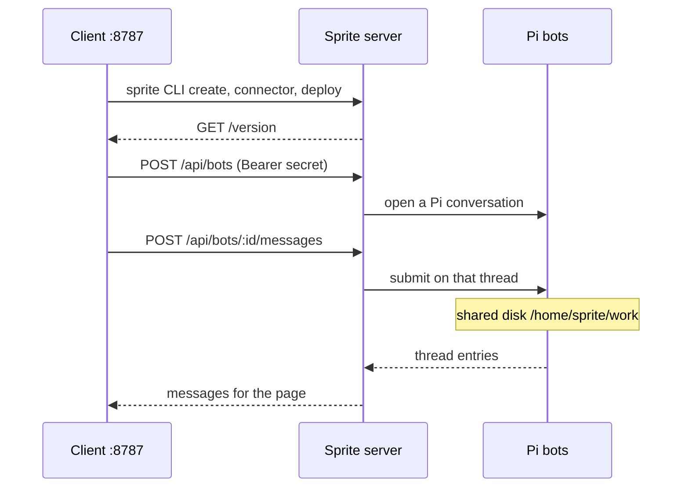

# Architecture

Pi Orbs is two processes. The client is what you install and open in a browser. The server is what runs on one Fly.io Sprite and hosts the bots.

## Client and server

The client listens on port 8787. `npx pi-orbs`, `npm start`, and `node ./bin/pi-orbs.js` all load `client/dist` (built from `client/src`). The page is http://127.0.0.1:8787. That process serves `client/public` and the `/api/sprites` routes the page calls. It talks to Sprites with the [sprite CLI](https://sprites.dev) on your machine.

The server is `server/dist/server.js`, built from `server/src/server.ts`. During normal use it runs on the Sprite. **Create and deploy** and **Push server build** pack `server/dist`, `server/package.json`, `server/package-lock.json`, and `server/VERSION`, copy that archive onto the Sprite, and `npm install --omit=dev` under `/home/sprite/app`. The Sprite service `web` is then recreated as:

- command: `/.sprite/bin/node /home/sprite/app/dist/server.js`
- working directory: `/home/sprite/work`
- HTTP port: `8080`

The client marks the Sprite URL public (`sprite config update --url-auth public`) and calls that URL. `GET /version` is unauthenticated and returns `{ "version": "<server/VERSION>" }`. Other routes require `PI_API_SECRET`, sent as `Authorization: Bearer` (the server also accepts `x-api-key`).

The client keeps a single sprite. A successful create replaces `sprites` in the state file with that one entry.

## State

The client stores its sprite on the machine where it runs, at `~/.pi-orbs/state.json`. The file is created on first successful deploy. Local simulator mode does not read or write it.

The JSON is `{ "sprites": [ { "name", "url", "secret", "xaiKey", "connectorId" } ] }`.

- `name` is the Sprite name.
- `url` is the public Sprite URL.
- `secret` is `PI_API_SECRET`, generated by the client (`randomBytes(24)` hex) and reused for that name if the file already has it.
- `xaiKey` is the key from the setup form.
- `connectorId` is the Sprites connector created for that key.

The page never receives `xaiKey`. The client drops it from API responses. Leave this file on that machine. Do not commit it or paste it into an issue. See [SECURITY.md](../SECURITY.md).

Create writes the file only after `GET /version` succeeds. **Push server build** writes the connector id before it installs, so a failed push can still leave a state file in place.

## xAI connector

The setup form sends the xAI key to the client. The client stores it in a Sprites connector named `pi-orbs xAI` (`custom_api`, header bearer token, base URL `https://api.x.ai/v1`). If a connector with that name already exists, the client reuses its id and does not replace the token.

The server does not get the key. Its service environment is:

| Variable | Value |
| --- | --- |
| `PI_API_SECRET` | the secret from the state file |
| `PI_MODEL` | `grok-4.7` |
| `PI_DB` | `/home/sprite/app/data/agent.sqlite` |
| `PI_CWD` | `/home/sprite/work` |
| `PI_XAI_BASE_URL` | `https://api.sprites.dev/v1/gateway/custom_api/<connector id>` |
| `XAI_API_KEY` | `connector` |
| `PORT` | `8080` |

`XAI_API_KEY=connector` is a placeholder. The model client uses `PI_XAI_BASE_URL`, so bot requests go through the Sprites gateway, which holds the key. **Destroy sprite** deletes that connector, then destroys the Sprite.

## Bots and `/home/sprite/work`

Each bot is one Pi conversation in a single pi-durable harness. The harness database is `/home/sprite/app/data/agent.sqlite`. The roster is `/home/sprite/app/data/bots.json` (id, name, conversation id). Threads are separate. The coding tools for every bot use `PI_CWD`, which deploy sets to `/home/sprite/work`, and the `web` service uses that directory as its working directory. Bots on the sprite share that disk.

Sending a message submits text to that conversation and returns immediately (`202`). The page reloads the thread every few seconds.

**Destroy sprite** deletes the Sprite, which removes that disk, the bots, and the URL.

## Request path

`npm run dev:local` (or `PI_ORBS_MODE=local`, or `--local`) stays in the client process. `client/src/local.ts` answers the same `/api` routes from memory, with a seeded roster on a pretend sprite named `atlas`, and leaves `~/.pi-orbs/state.json` untouched. `GET /api/sprites` includes `simulator: true` in this mode. The page shows a Local simulator badge when that flag is set. Create, deploy, and destroy are stubbed: they succeed in memory and do not call the sprite CLI.

## Troubleshooting

### sprite CLI missing or not logged in

Create, deploy, and destroy spawn `sprite`. The client looks on `PATH`, and also in `~/.local/bin` and `~/.fly/bin`.

If the binary is missing, the setup page shows a spawn error (`spawn sprite ENOENT`). Install the [sprite CLI](https://sprites.dev) and open a new shell so `sprite` resolves. `sprite api /v1/sprites` should print JSON.

If the CLI is present and not logged in, the page shows the CLI's stderr from that command. Log in, then submit the form again.

`npm run dev:local` does not use the CLI. `npm run build` and `npm test` do not either.

### Node version

The client needs Node 20 or newer (`engines` in the root `package.json`). Node 20 can serve the page and run the simulator.

The server process uses `node:sqlite`. Node 20 does not include it. The server tests inside `npm test`, and running `server/dist/server.js` on your machine, need Node 22. On Node 20 the server exits with `ERR_UNKNOWN_BUILTIN_MODULE`. The client simulator tests run on Node 20: `npm test --prefix client`. CI builds on Node 20 and Node 22. The Node 22 job runs `npm test`. The Node 20 job runs the client simulator tests.

The Sprite service runs `/.sprite/bin/node` from the Sprite image. The Node on your laptop is only for the client, the simulator, and `npm test`.

### Deploy returns 502 on `/version`

After install, the client requests `{sprite url}/version` with an 8 second timeout. No response, a non-200, or a body without `version` becomes:

- `sprite was created, but the server did not answer /version` on create (`502`)
- `deploy finished, but the server did not answer /version` on push (`502`)

On that create error the state file is unchanged, because create writes it only after `/version` succeeds. The Sprite may already exist, and the connector may already exist. Submit the same name and key again. The client skips `sprite create` when that name is already listed. A connector named `pi-orbs xAI` is reused as-is, so a different key on this retry stays out of the gateway until that connector is deleted.

If the state file does have the sprite and `/version` is quiet, the page stays on setup: the name "exists, but its server is not answering." **Finish deploy** pushes the server again. Leave the key field blank so it uses the key already in the state file. A key typed here is saved, and the existing `pi-orbs xAI` connector is still reused with its current token. Destroy the sprite (that deletes the connector) before creating it again with a new key.

A failure earlier in deploy is a `500`, with the sprite CLI's stderr. Typical cases are `npm install` on the Sprite failing, or the `web` service never reporting `"status": "running"`. Fix that output, then deploy again. The version check runs only after the service reports running.

### Update and push a server build

The sidebar shows the local `server/VERSION`. Settings shows the Sprite URL, `running` plus the remote `/version`, and `update available` when those strings differ.

**Settings → Push server build** packs the server that sits next to this client and recreates `web`. From a checkout, run `npm run build` first so `server/dist/server.js` exists. The published npm package already includes that `dist`. Push replaces the process. It leaves `/home/sprite/app/data` and `/home/sprite/work` in place, so bots and files remain.

A code change reaches the Sprite when this client packs and pushes. After a push, `running` should match `server/VERSION`. If the button returns the 502 above, the service came up and `/version` did not answer in time. Push once more.

In the local simulator, create, deploy, and destroy are stubbed. **Push server build** returns success and does not install anything. Destroy clears the in-memory sprite and does not write `~/.pi-orbs/state.json`.
